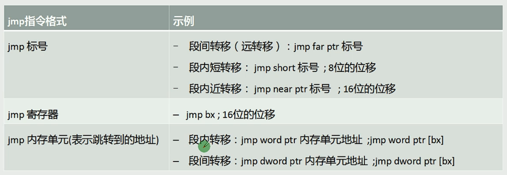
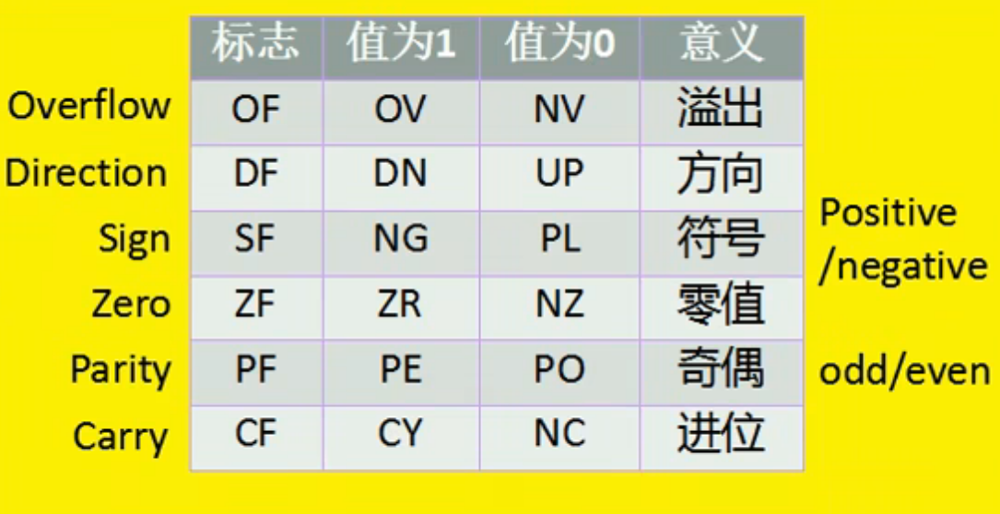
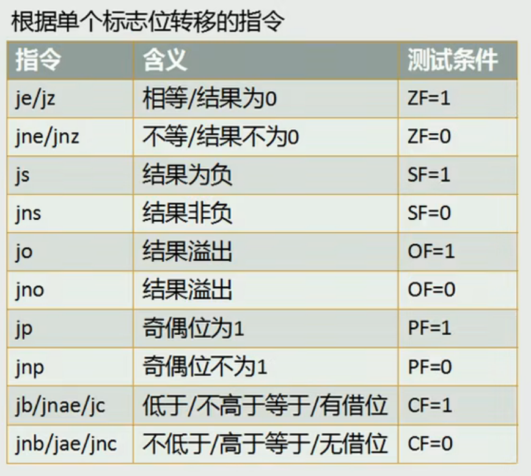

## CS、IP 与代码段

`cs` 属于寄存器中的段寄存器中的代码段寄存器

`ip` 是指令指针寄存器

`cs:ip` CPU 会将内存中 cs:ip 指向的内容当作指令执行

过程：16 位的 cs 和 16 位的 ip 通过位址加法器生成 20 位的地址，通过地址总线找到内存中的对应位置的内容，通过 16 位的数据总线运送指令（指令由若干个字组成）到指令缓冲器，执行指令内容后，将 ip+指令长度。

举例：当然 CPU 状态，CS 中内容为 2000H，IP 中内容为 0000H。cs:ip 将会是 20000H，接下来通过地址总线从内存中取一个指令，这个指令为 mov ax,0123H （这个指令的长度为 3 个字节），然后这个指令会通过数据总线送入到指令缓冲器中，由执行控制器执行后，ip 的值加 3。

> CPU 能处理的数据长度是字长，内存中一个地址对应的大小是一个字节(byte)

## jmp 指令

同时修改 cs、ip 的内容

jmp 段地址:偏移地址，比如 jmp 2AE3:3，其中段地址修改 cs，偏移地址修改 ip

仅修改 ip 的内容

jmp 寄存器，比如 jmp ax

## 内存中字的存储

数据总线是 16 位的，cpu 一次处理的长度是 16 位，寄存器的长度为 16 位，内存中一个地址对应一个字节，是 8 位的。那么 16 位的字是如何在内存中存储呢？

16 位的字在内存中以 2 个连续字节进行存储，具体地，低位字节存在低地址单元，高位字节存放在高地址单元

## DS + [address]

CPU 读取内存单元的数据时，需要给出这个内存单元的地址。这个内存单元的地址由段地址和偏移地址组成。那么段地址和偏移地址可以从哪来呢，这里有一个方法，就是 DS + [address]

## 栈

CPU 如何知道一段内存空间被当作栈使用？如何定位栈顶单元？

对栈的操作是以字为单位的

`栈段寄存器 ss` 存放栈顶的段地址

`栈顶指针寄存器 sp` 存放栈顶的偏移地址

这样，栈顶指向的内存单元永远是 ss:sp 处，每次 push，sp = sp - 2；每次 pop，sp = sp + 2

## 段总结

三种段：数据段、代码段、栈段

数据段：段地址放在 DS 中，CPU 将对应位置的内容识别为数据

代码段：段地址放在 CS 中，段中的第一条指令的偏移地址放在 IP 中，CPU 将对应位置的内容识别为指令

栈段：段地址放在 SS 中，栈顶的偏移地址放在 SP 中，在进行栈操作时，CPU 就将我们定义的栈段当作栈空间来使用。

数据段和代码段如何区分？

在内存中来看没有区别，只是 CPU 决定的，CPU 将 cs:ip 指向的内存单元就当作代码段，将 ds:[address]就当作数据段

## Jump

## call 和 ret

**call 标号**

1. call 标号，实现段内转移，类似 jmp near ptr 标号
2. call far ptr 标号，实现段间转移，类似 jmp far ptr 标号

**call 使用寄存器**

call 16 位寄存器

**call 在内存中**

call word ptr 内存单元地址 （两个字节）= push ip + jmp word ptr 内存单元地址

call dword ptr 内存单元地址（四个字节）= push cs + push ip + jmp word ptr 内存单元地址

**ret 指令**

用栈中的数据，修改 IP 的内容，从而实现近转移，相当于 pop IP

**retf 指令 （return far）**

用栈中的数据，修改 CS 和 IP 的内容，从而实现远转移，相当于 pop IP，pop CS

## 标志寄存器

标志寄存器是按位起作用的，某些位有特殊的含义，有些位没有用到，不具有任何含义

8086 中标志寄存器位的含义

访问标志寄存器的方法

`pushf` 将标志寄存器的值压栈

`popf` 从栈中弹出数据，送入标志寄存器中

对比 `CF-进位标志` 和 `OF-溢出标志`

CF 是对无符号数运算有意义的进/借位标志位

OF 是对有符号数运算有意义的溢出标志位

一个视为无符号数，一个视为有符号数，具体是要用哪个取决于你把数视为什么类型的数

## cmp 指令

使用方式：cmp 操作对象 1，操作对象 2

cmp 是比较指令，功能相当于减法指令，只是不保存结果。结果执行后，对标志寄存器产生影响

## 条件转移指令

