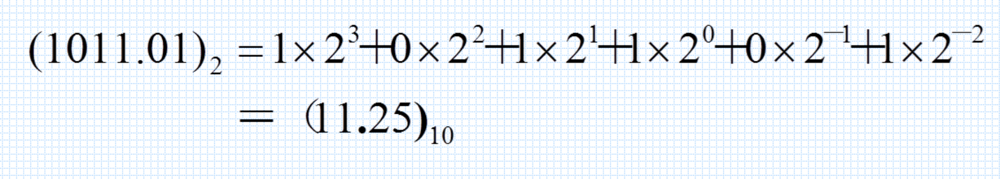
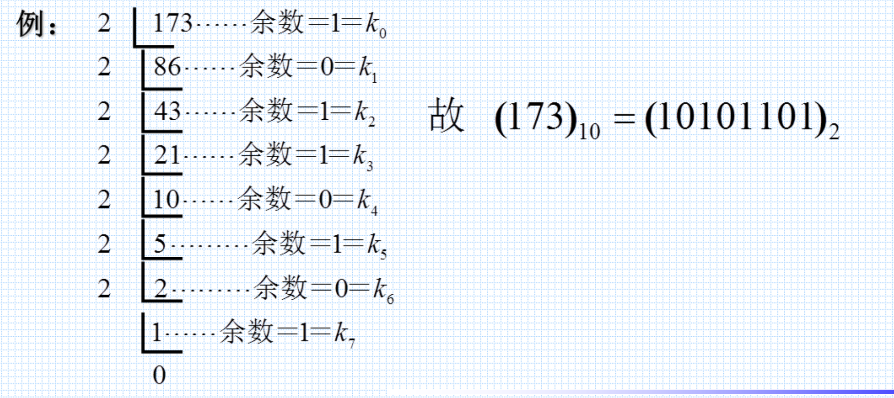
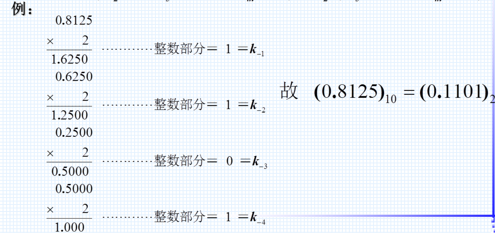
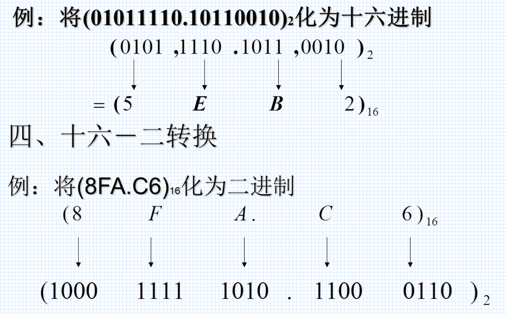
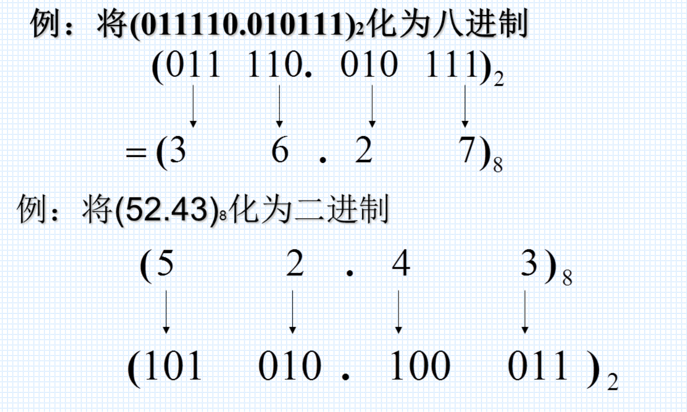
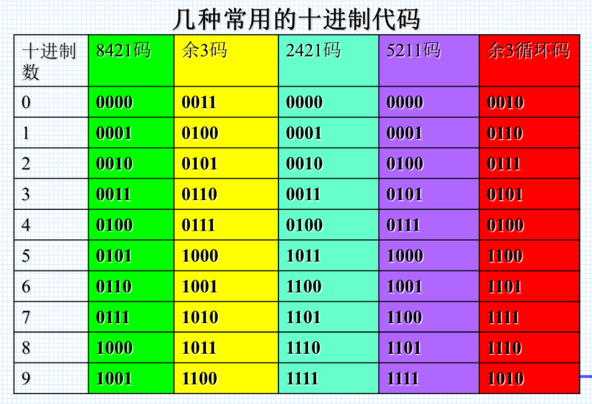
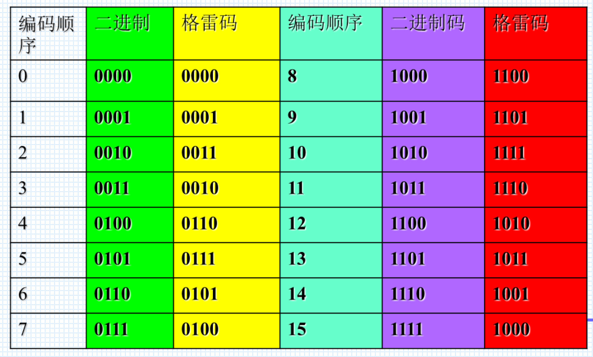

### 数制和码制

数码中每一位的构成方法和低位到高位的进位规则称为**数制**，比如十进制，二进制，八进制，十六进制

一些常见的十进制编码有：8421码、余3码、2421码等

## 不同进制之间的转换

### 二进制转十进制

个位是2的0次方，以此类推

### 十进制转二进制

整数部分：模2取余法

小数部分：乘2取进位

### 二进制与十六进制相互转换

### 八进制与二进制的相互转换

### 十六进制与十进制的相互转换

十六进制转十进制：乘以 16 的某某次方

十进制转十六进制：通过二进制转化

## 原、反、补码的计算

反码：数值位逐位求反

补码：正数的补码和原码相同；负数的补码等于数值位逐位求反（反码） + 1

补码计算出来的最高位就是符号位

## 几种常用的编码

### 十进制代码

### 格雷码

相邻代码只有一位改变状态，减少过渡噪声

