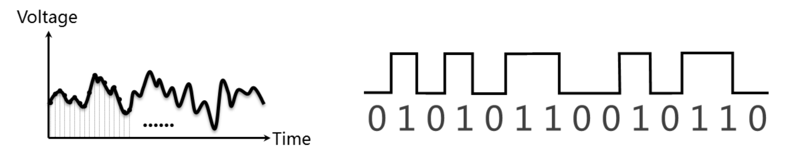
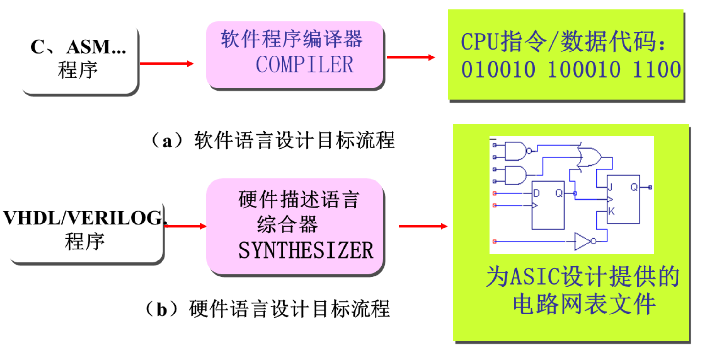
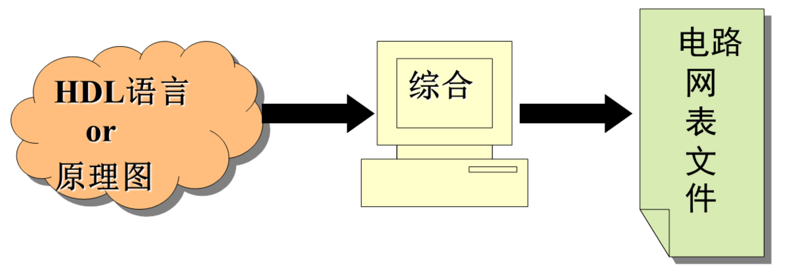

### 数字技术

A\D 转换、数字逻辑处理、D\A 转换：将现实的信息转化为数字，即使用二进制进行保存；通过对数字逻辑进行一些处理（运算、加工、存储等）；再将数字信息还原为信息。

### 模拟信号与数字信号

**模拟信号**描述时间和数值上连续的物理量，比如正弦波方波、矩形波等；

**数字信号**用01来表示事物的对立两面。

## EDA 技术

### 什么是EDA技术

EDA（Electronic Design Automation）

以计算机为工作平台，以EDA软件工具为开发环境，以FPGA器件或者ASIC专用集成电路为目标器件设计实现电路系统的一种技术。

在设计过程中，只需关注**硬件的行为和功能**，**其它均由计算机自动完成**。

### EDA 设计方法

自上而下的设计方法，将数字系统的整体逐步分解为各个子系统和模块

### EDA、PLD、HDL、FPGA、Verilog HDL

EDA是一种技术；EDA的实现载体：可编程逻辑器件（PLD）；描述方式：硬件描述语言（HDL）；FPGA是常用的PLD器件；Verilog PLD是硬件描述语言中的一种。

### 软件编译器和硬件综合器

生成的目标文件不同

### EDA 设计的优势

把逻辑设计与具体电路的实现分成两个独立的阶段来操作；逻辑设计与实现的工艺无关，并且逻辑设计可以重复利用；当写好HDL文本之后后，通过**综合**生成低层的便于可编程器件实现的电路网表文件。

