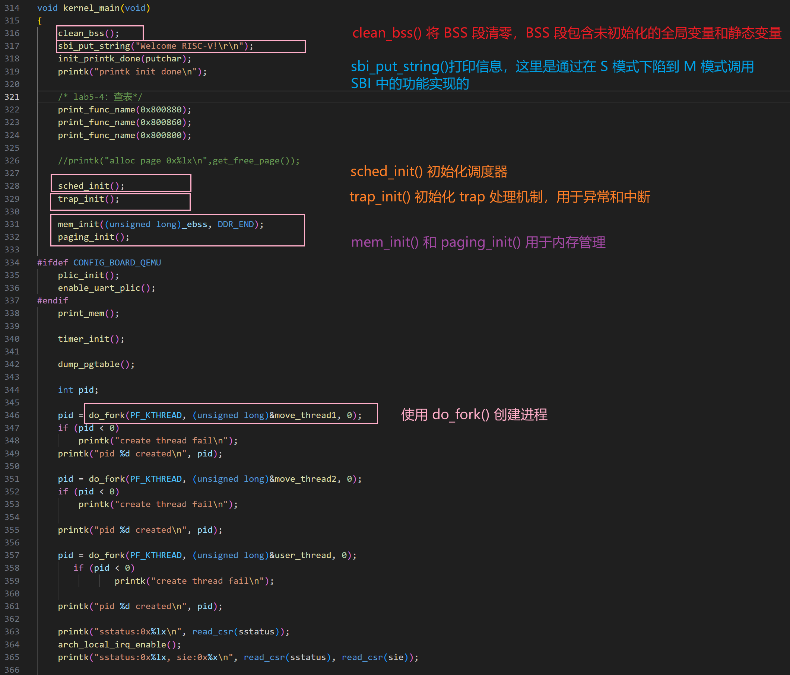
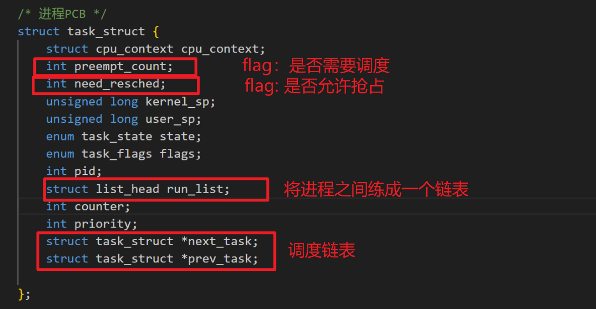

### 相关结构体

#### pt_regs 栈框

功能：用于保存中断现场或者异常现场

`pt_regs` 栈框通常位于进程的内核栈的顶部，保存了 `sepc`、`x1~x31 通用寄存器`、`CRSs`、`orig_a0`值。

`sepc`：`Supervisor Exception Program Counter`，当发生异常或中断时，将当前`PC`值保存到`sepc`中。、

`CRSs`：`Supervisor CSRs`，包括 `sstatus`、`sbadaddr`、`scause`。它们的的作用如下：

- `sstatus`：保存处理器的状态
- `sbadaddr`：`Supervisor Bad Address Register`，保存导致异常的地址
- `scause`：保存导致异常或者中断的原因

`orig_a0`：用于系统调用。系统调用中，`a0` 通常用于传递系统调用号，`orig_a0` 保存了系统调用前的 `a0` 的值，便于在处理系统调用时可以访问该值。

内容：

```c
/*
 * pt_regs栈框，用来保存中断现场或者异常现场
 *
 * pt_regs栈框通常位于进程的内核栈的顶部。
 * 保存内容：
 *    sepc
 *    x1 ~ x31 通用寄存器
 *    CSRs
 *
 * 一共需要保存36个寄存器，共288个字节
 */
struct pt_regs {
	/* 31个通用寄存器 + sepc */
	unsigned long sepc;
	unsigned long ra;
	unsigned long sp;
	unsigned long gp;
	unsigned long tp;
	unsigned long t0;
	unsigned long t1;
	unsigned long t2;
	unsigned long s0;
	unsigned long s1;
	unsigned long a0;
	unsigned long a1;
	unsigned long a2;
	unsigned long a3;
	unsigned long a4;
	unsigned long a5;
	unsigned long a6;
	unsigned long a7;
	unsigned long s2;
	unsigned long s3;
	unsigned long s4;
	unsigned long s5;
	unsigned long s6;
	unsigned long s7;
	unsigned long s8;
	unsigned long s9;
	unsigned long s10;
	unsigned long s11;
	unsigned long t3;
	unsigned long t4;
	unsigned long t5;
	unsigned long t6;
	/* Supervisor CSRs */
	unsigned long sstatus;
	unsigned long sbadaddr;
	unsigned long scause;
	/* a0 value before the syscall */
	unsigned long orig_a0;
};
```


#### cpu_context 处理器上下文

功能：描述了一个进程切换时 CPU 需要保存哪些寄存器的值，即处理器上下文。

在进程切换中，我们需要把 prev 进程的 s0~s11 寄存器、sp 寄存器、ra 寄存器保存到 cpu_context 数据结构中，然后把 next 进程中上一次保存的 cpu_context 的值恢复到处理器的寄存器中，这样就完成了进程上下文切换。

内容：

```c
/* 进程切换时候需要保存的上下文 */
struct cpu_context {
	unsigned long ra;
	unsigned long sp;	/* 栈指针 */

	/* 函数调用必须要保存的通用寄存器 */
	unsigned long s[12];	/* s[0] 是FP, 总共是 s0 ~ s11 */
};
```


#### task_struct 进程控制块

功能：进程控制块（Process Control Block，PCB），描述了一个进程的信息。

内容：

```c
/* 进程PCB */
struct task_struct {
    struct cpu_context cpu_context;  // 进程切换时的硬件上下文
    int preempt_count;               // 抢占计数  *
    int need_resched;                // 是否需要重新调度  *
    unsigned long kernel_sp;         // 内核栈指针 *
    unsigned long user_sp;           // 用户栈指针 *
    enum task_state state;           // 进程状态
    enum task_flags flags;           // 进程标志, 目前只用来表示进程是否为内核进程
    int pid;                         // 进程ID
    struct list_head run_list;       // 运行队列链表 *
    int counter;                     // 进程调度用的时间片
    int priority;                    // 进程优先级
    struct task_struct *next_task;   // 指向下一个任务的指针 *
    struct task_struct *prev_task;   // 指向上一个任务的指针 *
};
```


####  task_union 内核栈

功能：`task_union` 将进程的内核栈和进程控制块紧密结合在一起，方便管理和调度，内核栈用于保存进程在内核态下执行时的临时数据和函数调用信息。


内容：

```c
/*
 * task_struct数据结构存储在内核栈的底部
 */
union task_union {
	struct task_struct task;
	unsigned long stack[THREAD_SIZE/sizeof(long)];
};
```


### BenOS 从启动到执行

在没有进程切换的情况下，BenOS 的启动流程是 上电 → MySBI 固件 → BenOS 汇编入口 → kernel_main() 函数。从进程的角度看，init 进程可以看出系统的 “0 号进程”。

由于现在考虑进程切换，所以将这个 0 号进程进行管理，之后再使用 do_fork() 函数即可创建新的进程。


系统上电后，RISC-V处理器运行在 M 模式。通常 SBI 固件运行在 M 模式下，为运行在 S 模式下的操作系统提供引导服务以及 SBI 服务。而后进入 BenOS 的初始化程序中，在 sbi_main.c 文件中，设置了 mepc 寄存器的地址为 0x8020 0000，而后执行 mret 指令会跳转到 0x8020 0000 地址处。BenOS 操作系统的S模式的入口地址也是 0x8020 0000，于是在 MySBI 执行后会进入 BenOS 操作系统 S 模式。


#### MySBI 固件启动到执行

MySBI 启动用的汇编代码，此时处理器运行在 M 模式，程序从 _start 段开始执行。

```assembly
# file: "benos/sbi/sbi_boot.S"
.section ".text.boot"

.globl _start
_start:
	/* 关闭M模式的中断*/
	csrw mie, zero

	/* 设置栈, 栈的大小为4KB */
	la sp, stacks_start
	li t0, 4096
	add sp, sp, t0
	/* 
	   把M模式的SP设置到mscratch寄存器，
	   下次陷入到M模式可以获取SP
	 */
	csrw mscratch, sp

	/* 跳转到C语言 */
	tail sbi_main

.section .data
.align  12
.global stacks_start
stacks_start:
	.skip 4096
```

执行完这段汇编代码后进入 C 语言的 `sbi_main()` 函数执行。

```assembly
# file: "benos/sbi/sbi_main.c"
/*
 * 运行在M模式
 */
void sbi_main(void)
{
	unsigned long val;

	uart_init();

	init_printk_done(putchar);
	printk(BANNER);

	sbi_trap_init();

	/*
	 * 配置PMP
	 * 所有地址空间都可以访问
	 */
	sbi_set_pmp(0, 0, -1UL, PMP_RWX);
	sbi_set_pmp(1, 0x80000000, 0x40000, PMP_RWX);

	/* 设置跳转模式为S模式 */
	val = read_csr(mstatus);
	val = INSERT_FIELD(val, MSTATUS_MPP, PRV_S);
	val = INSERT_FIELD(val, MSTATUS_MPIE, 0);
	write_csr(mstatus, val);

	delegate_traps();

	/* 设置M模式的Exception Program Counter，用于mret跳转 */
	write_csr(mepc, FW_JUMP_ADDR);
	/* 设置S模式异常向量表入口*/
	write_csr(stvec, FW_JUMP_ADDR);
	/* 关闭S模式的中断*/
	write_csr(sie, 0);
	/* 关闭S模式的页表转换 */
	write_csr(satp, 0);

	/* 切换到S模式 */
	asm volatile("mret");
}
```

 `sbi_main()` 函数的主要目的是把处理器从 M 模式切换到 S 模式，并跳转到 S 模式的入口地址处。

<br>

#### BenOS 0号进程的创建

BenOS 内核启动用的汇编代码，位于 `benos/src/boot.S` 文件中，内容如下：

```assembly
.section ".text.boot"

.globl _start
_start:
	/* 关闭中断 */
	csrw sie, zero

	call __init_uart
	call print_asm

	/* 设置栈: init_task_union + THREAD_SIZE*/
	la sp, init_task_union
	li t0, THREAD_SIZE
	add sp, sp, t0
	la tp, init_task_union

	//call create_page_table
	//call enable_mmu_relocate

	/* 跳转到C语言 */
	tail kernel_main
```

由于现在有进程切换的概念，所以当前要做的是创建并执行 0 号进程。由于进程需要有进程控制块来描述，还需要用到栈空间，以及将 `SP` 指向栈底和`TP`指向`task_struct` 结构体。所以，**使用 INIT_TASK 宏来静态初始化 0 号进程的进程控制块，再将 0 号进程的内核栈空间链接到数据段，并设置 SP 和 TP**。

创建 0 号进程的进程控制块

```c
/* 0号进程即init进程 */
#define INIT_TASK(task) \
{                      \
	.state = 0,     \
	.priority = 10,   \
	.counter = DEF_COUNTER, \
	.flags = PF_KTHREAD,   \
	.pid = 0,     \
	.preempt_count = 0, \
	.need_resched = 0, \
	.next_task = (struct task_struct *)&task, \
	.prev_task = (struct task_struct *)&task, \
}

/* 0号进程为init进程 */
union task_union init_task_union __init_task_data
			= {INIT_TASK(init_task_union.task)};
```

为 0号进程分配栈空间，并将内核栈编译链接到`.data.init_task`段中

```c
/* 把0号进程的内核栈 编译链接到.data.init_task段中 */
#define __init_task_data __attribute__((__section__(".data.init_task")))

/* 定义一个全局的task_struct数组来存放进程的PCB*/
struct task_struct *g_task[NR_TASK] = {&init_task_union.task,};
```

设置 SP，使 SP 指向栈底；设置 TP（Thread Pointer，线程指针），指向 task_struct 数据结构，这样可以通过 TP 获取当前进程的 task_struct 数据结构。

```assembly
/* 设置栈: init_task_union + THREAD_SIZE*/
la sp, init_task_union
li t0, THREAD_SIZE
add sp, sp, t0
la tp, init_task_union
```

而后，通过 `tail kernel_main`跳转到 C 语言，继续执行后面的操作。

<br>

#### BenOS 内核启动和执行

`kernel_main()` 函数中，主要执行的操作为：`sched_init()` 配置进程调度，`trap_init()` 配置中断和异常的处理，`mem_init()` 和 `paging_init()` 初始化内存管理，包括物理内存和分页机制，`do_fork()` 创建内核线程。



<br>

#### 内核态进程的切换

一个进程有内核栈和 task_struct 信息，task_struct 中有 cpu_context 信息，在进程切换中，需要完成的事情有：

1. 保存当前CPU上下文到`prev`进程的`task_struct->cpu_context`，再从`next`进程的`task_struct->cpu_context` 中恢复上下文到CPU
2. 让`tp`寄存器的值指向`next`进程的 `task_struct`


进程切换函数 `switch_to`

```c
struct task_struct * switch_to(struct task_struct *prev, struct task_struct *next)
{
	if (prev == next)
		return NULL;

	return cpu_switch_to(prev, next);
}
```

`cpu_switch_to` 的汇编实现：

```assembly
.align 2
.global cpu_switch_to
cpu_switch_to:
	li    a4,  TASK_CPU_CONTEXT
	add   a3, a0, a4
	add   a4, a1, a4

	/* 保存CPU上下文到prev进程的task_struct->cpu_context */
	sd ra, 0(a3)
	sd sp, 8(a3)
	sd s0, 16(a3)
	sd s1, 24(a3)
	sd s2, 32(a3)
	sd s3, 40(a3)
	sd s4, 48(a3)
	sd s5, 56(a3)
	sd s6, 64(a3)
	sd s7, 72(a3)
	sd s8, 80(a3)
	sd s9, 88(a3)
	sd s10, 96(a3)
	sd s11, 104(a3)

	/* 从next进程的task_struct->cpu_context中恢复上下文到CPU */
	ld ra, 0(a4)
	ld sp, 8(a4)
	ld s0, 16(a4)
	ld s1, 24(a4)
	ld s2, 32(a4)
	ld s3, 40(a4)
	ld s4, 48(a4)
	ld s5, 56(a4)
	ld s6, 64(a4)
	ld s7, 72(a4)
	ld s8, 80(a4)
	ld s9, 88(a4)
	ld s10, 96(a4)
	ld s11, 104(a4)

	/* tp point to task_struct*/
	move tp, a1

	ret
```


<br>

#### 进程的调度

由于有进程的调度，所以需要扩展 task_struct 结构体的内容。在之前进程的创建和执行时，有优先级，状态、ID等信息。



task_struct 是使用数组来存储的，而进程之间的前后调度关系是使用链表来表示的。

**调度涉及到的数据结构**

两个数据结构，用于辅助完成调度这项任务的。

1.  `struct sched_class`类似于调度类的接口，每个调度类需要实现一组函数，用于管理进程的调度。
1.  `struct run_queue` 定义了运行队列的数据结构，用于管理所有就绪状态的进程，并记录当前运行的进程和调度器的性能信息。这样可以用于后面更好的选择优先级。

**简易调度实现**

这个调度算法通过 `counter` 值来决定进程的调度顺序。每个时钟滴答减少当前进程的 `counter` 值，当 `counter` 值为0时，重新选择一个 `counter` 值最大的进程运行。如果所有进程的 `counter` 值都为0，重置所有进程的 `counter` 值。这个算法类似于时间片轮转调度，但加入了优先级的考虑。在这里的优先级就是：**哪个进程的时间片剩余时间长，哪个调度算法更优先。**

在 BenOS 中，简易的调度算法实现为 pick_next_task_simple 函数。用于选择下一个进程。步骤为：

1. 遍历运行队列，计算每个进程的权重（`goodness`），选择权重最大的进程。（在代码中的实现是指，时间片越长，权重越大）
2. 重置。如果进程一直运行，会有counter执行完的时候，这时候就所有进程的权重都设置为0，重置所有进程的 `counter` 值，然后重新遍历运行队列。


<br>

>  source：[操作系统-Benos源码分析-2025.01.05](https://blog.hzau.top/posts/notebook/operation_system/benos-source-analysis/)


