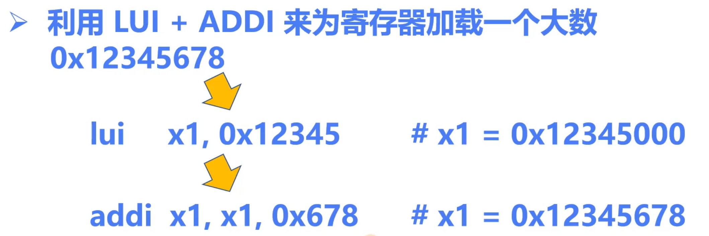

### 计算机存储方式（小端序 vs 大端序）

Question：如何有一条以二进制/十六进制表示的指令数据，应该怎么翻译为对应的指令？

当计算机使用小端序（Little Endian）存储数据时，低位字节存储在低地址，读数据时需要按照这个顺序解释。人类通常按大端序（Big Endian）读取数字，即高位字节在前。

对于字节序列 `b3 02 73 00`：

1. 小端序存储的顺序是 `b3 02 73 00`。
2. 为了正确读取该值，我们需要将其倒过来按大端序的顺序理解，即 `00 73 02 b3`。
3. 这个字节序列转换为十六进制是 `0x007302b3`，对应的十进制值是 `7538329`。

倒过来读是因为计算机内存中的小端序需要反向排列字节，才能得到人类习惯的大端序数值。

---

### 算数运算指令

#### LUI

LUI 指令是用以辅助构造 LI 指令的

LUI指令会构造一个 32 bits 的立即数，这个立即数的高 20 位对应指令中的 imm，低 12 位清零。这个立即数作为结果存放在 RD 中

 

**Question：** 如何利用LUI + ADDI 来为寄存器加载一个大数（0x12345678）？

方法是通过移位+补上去的方式，如图：

但其中有特殊情况，因为在**addi**步骤中有个对数字进行符号扩展的操作，可能会把数值当作负数来处理

处理方法是进位，正确处理方法如下：

于是乎，为了方便编程，提供了一个**伪指令 LI** 来对大数进行了处理，避免手动判断的麻烦，功能是**加载立即数**

---

#### LI

---

#### AUIPC

这个指令与 LUI 指令类似，也会构造一个 32 位的立即数，高 20 位对应 IMM，低 12 位清零用于相加。和 LUI 的区别在于：AUIPC 会先将这个立即数和 PC 相加，相加的结果存为 RD 中。

#### LA (Load Address)

LA 是一个伪指令，编译器会根据实际情况利用 AUIPC 和其它指令生成正确的指令序列，常常用于加载一个函数或者变量的地址

---

#### 算数运算指令汇总

---

#### 逻辑运算指令汇总

---

#### 移位运算指令汇总

---

#### 内存读写指令汇总

---

#### 条件分支指令汇总

