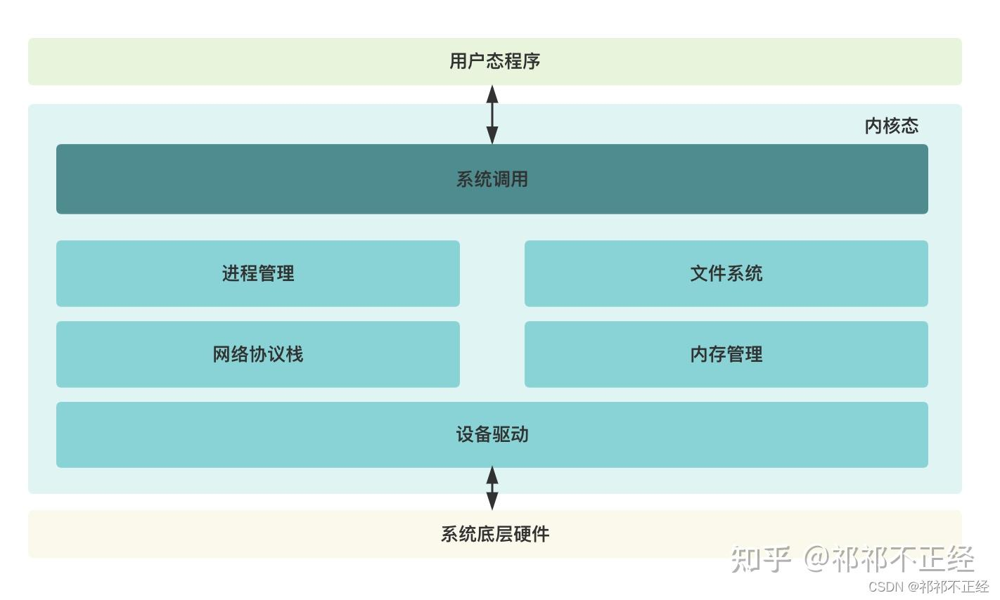
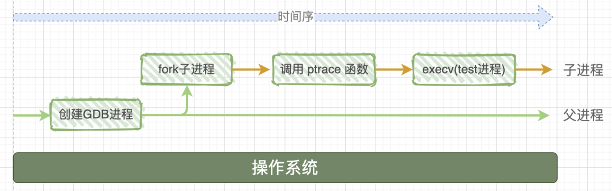
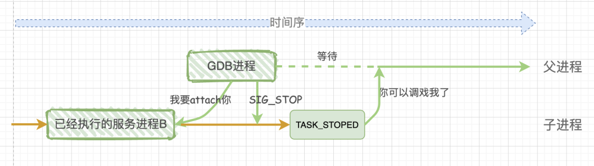

#### 1. 用户态和内核态

在计算机的体系结构中，粗略分为 **CPU**、**操作系统内核**、**应用程序** 三层。 用户态（User Mode）和内核态（Kernel Mode）主要是操作系统层面的概念，但它们的实现和切换和 **CPU特权级别分层机制** 密不可分。什么是 CPU特权级别分层机制 呢？其中涉及到的`特权级别分层`本质上是`CPU指令集权限分级`，在 CPU 层面，会设计不同权限等级的 CPU 指令，不同权限等级下的指令或者寄存器会有差别。

[ptrace](https://man7.org/linux/man-pages/man2/ptrace.2.html)，即`process trace`，从其名字上就能看出，`ptrace()系统调用`能提供追踪进程执行状态的功能。根据官方手册的介绍：`ptrace()`系统调用为一个进程提供了**观察**和**控制**另一个进程的执行过程的能力，同时也提供**检查**和**改变**另一个进程的内存值以及相关注册信息。其中，被控制的进程被称为`tracee`，控制进程被称为`tracer`。

以 RISC-V 来举例，以 RISC-V 为基础的 CPU 指令集架构会支持 M（Machine）、S（Supervisor）和 U（User）三种CPU特权级别。M-Mode 一般不用做日常任务，而是操作系统启动和处理硬件异常（例如启动时引导程序、处理硬件中断等）。 S-Mode 对应于 内核态，U-Mode 对应于用户态。例如，S-Mode 下的许多控制状态寄存器（CSR）都会向上为操作系统提供支持。

于是，内核态能够对内存调度等进行管理，也能直接操作硬件资源。用户态用于处理应用程序，只能通过调用等机制请求操作系统的服务。那么用户态让内核态代为完成这个过程就是 **系统调用**。

用户态的程序如果想要操作系统底层硬件，就只能通过`系统调用`让位于内核态的程序来帮助其完成系统底层硬件的操作，待内核态程序处理完成之后再将结果返回给用户态程序。用户态、系统调用、内核态和系统底层硬件之间的关系如下图所示：



> 由系统调用可以牵扯出一个概念——`CPU上下文切换`。`CPU上下文切换`指的是CPU处理过程中的CPU寄存器和程序计数器`pc`值的切换。

#### 2. ptrace 系统调用函数

由上述内容可知，用户态的程序执行时想要完成一些功能时，只能通过系统调用的方式让内核态程序来帮助它执行。这里 `ptrace` 就是 Linux 系统调用函数的一种，它的功能是**追踪进程执行状态**。

**函数签名**

`ptrace()`系统调用的函数签名如下：

```c
#include <sys/ptrace.h>       
long ptrace(enum __ptrace_request request, pid_t pid, void *addr, void *data);
```

对函数签名中的四个参数表示的含义：

- request：要执行的操作类型；
- pid：被追踪的目标进程ID；
- addr：被监控的目标内存地址；
- data：保存读取出或者要写入的数据。

**进程状态**

在Linux系统中，进程常见的状态有下面一些：

- S：Interruptible Sleeping，即可中断睡眠；
- D：Uninterruptible Sleeping，即不可中断睡眠；
- R：Running or Runnable，即运行状态；
- Z：Zombie，即僵尸状态；
- T：Stopped or Traced，即中止状态（注意是“中止”而非“终止”）。

在这里的 ptrace 就用到了 `T：Stopped or Traced`这个类型。这里涉及到两种状态`Stopped`和`Traced`。当进程运行时，用户按下`ctrl+z` 时，这个进程就进入了 stopped 这个状态，再使用`ptrace`系统调用就可以让进程进入Traced状态。

**Traced状态**

让一个进程进入`Traced`状态可以通过两种方式：

1. `tracee`进程调用`ptrace`系统调用，并在`request`参数处传递`PTRACE_TRACEME`这个值，表示想要被`tracer`进程追踪。通过这种方式的进程想要进入`Traced`状态有两种方式：
   - 主动调用`exec`系列的系统调用；
   - `tracer`发送进入`Traced`状态的相关信号。
2. `tracer`进程调用`ptrace`系统调用，并在`request`参数处传递`PTRACE_ATTACH`这个值，并给出`tracee`进程的`pid`，从而让`tracee`进程进入`Traced`状态。


**情况一：`tracee`进程调用`ptrace`系统调用，再主动调用`exec`系列的系统调用**

```c
#include <unistd.h>
#include <sys/ptrace.h>
#include <sys/wait.h>
#include <sys/user.h>
#include <sys/types.h>
#include <stdio.h>
#include <sys/reg.h>

int main(void){
    pid_t child;
    child = fork();
    if (child == 0){
        ptrace(PTRACE_TRACEME, 0, NULL, NULL); // 1.执行ptrace系统调用
        execl("/bin/ls", "ls", "-l", "-h", NULL); // 2. 使用execl系统调用
    } else {
        wait(NULL);
        // control child process
        ptrace(PTRACE_CONT, child, NULL, NULL);
    }
    return 0;
}
```


`fork()` 即创建了一个子进程。现在有两个进程，原先的这个进程，现在就是父进程，还有新复制的新进程，就是子进程。父进程返回的`child`值是子进程的`pid`，子进程返回的`child`值是0，所以**父进程中会进入 `else` 语句，而子进程中会进入 `child == 0` 的代码块中执行。**

代码块中的第一行子进程调用`ptrace`系统调用后，它会告诉内核它希望被其父进程跟踪，子进程并不会进入`Traced`状态。因为，子进程只有接收到 `SIGTRAP`信号后才会进入`Traced`状态。

这时候通过`execl`语句，内核会向子进程发送一个 `SIGTRAP`信号，子进程接收到 `SIGTRAP` 信号后，进入 `Traced` 状态，并暂停执行。


关注父进程部分

```c
#include <unistd.h>
#include <sys/ptrace.h>
#include <sys/wait.h>
#include <sys/user.h>
#include <sys/types.h>
#include <stdio.h>
#include <sys/reg.h>

int main(void){
    pid_t child;
    long orig_rax;
    child = fork();
    if (child == 0){
        ptrace(PTRACE_TRACEME, 0, NULL, NULL);
        execl("/bin/ls", "ls", "-l", "-h", NULL);
    } else {
        wait(NULL); // 1
        orig_rax = ptrace(PTRACE_PEEKUSER, child, 8 * ORIG_RAX, NULL);  // 2
        printf("Child process called a system call, id is %ld\n", orig_rax);
        ptrace(PTRACE_CONT, child, NULL, NULL); // 3
    }

    return 0;
}
```
代码分析：

```c
wait(NULL)
```

当使用了ptrace跟踪后，所有发送给被跟踪的子进程的信号(除了SIGKILL)，都会被转发给父进程。父进程会因为`wait`系统调用进入阻塞，当父进程接收到子进程的信号时，父进程才会接着运行。

```c
ptrace(PTRACE_PEEKUSER, child, 8 * ORIG_RAX, NULL)
```

父进程通过调用`ptrace`系统调用并使用`PTRACE_PEEKUSER`作为操作类型，可以**读取`tracee`进程的`USER`字段中相关偏移量位置的值。** 为什么要读取这个 USER 字段呢，因为可以通过传入 USER 字段的宏来获取寄存器值，在这里，`ORIG_RAX`这个寄存器里面存的是`系统调用号`。

```c
ptrace(PTRACE_CONT, child, NULL, NULL)
```

父进程通过调用`ptrace`系统调用并使用`PTRACE_CONT`作为操作类型，用于**恢复处于`Traced`状态的`tracee`进程**。


**使用PTRACE_SYSCALL循环捕获**

```c
#include <unistd.h>
#include <sys/ptrace.h>
#include <sys/reg.h>
#include <stdio.h>
#include <sys/wait.h>

int main(int argc, char **argv){
  pid_t child = fork();
  int status = 0;
  long orig_rax = 0;
  if (child == 0){
    ptrace(PTRACE_TRACEME, 0, NULL, NULL);
    execl("/bin/ls", "ls", "-l", "-h", NULL);
  } else {
    while(1){
      wait(&status);
      printf("Got signal %d\n", WSTOPSIG(status));
      if(WIFEXITED(status)) break;

      orig_rax = ptrace(PTRACE_PEEKUSER, child, 8 * ORIG_RAX, NULL);
      printf("Program called system call: %ld\n", orig_rax);
      ptrace(PTRACE_SYSCALL, child, NULL, NULL);
    }
  }
  return 0;
}
```

在之前代码的基础上，添加了`while`循环结构，将`PTRACE_SYSCALL`作为循环体中的`ptrace`系统调用类型，并且在 `WIFEXITED(status)` 状态下结束程序。

```c
  wait(&status);
  printf("Got signal %d\n", WSTOPSIG(status));
  if(WIFEXITED(status)) break;
```

通过 wait 调用可以获得接收到的信号类型，WSTOPSIG 是拿到导致子进程暂停的信号的编号，比如编号为`5`的信号对应的是`SIGTRAP`信号

```
[root@localhost ~]# kill -l
 1) SIGHUP   2) SIGINT   3) SIGQUIT  4) SIGILL   5) SIGTRAP
 6) SIGABRT  7) SIGBUS   8) SIGFPE   9) SIGKILL 10) SIGUSR1
11) SIGSEGV 12) SIGUSR2 13) SIGPIPE 14) SIGALRM 15) SIGTERM
16) SIGSTKFLT   17) SIGCHLD 18) SIGCONT 19) SIGSTOP 20) SIGTSTP
21) SIGTTIN 22) SIGTTOU 23) SIGURG  24) SIGXCPU 25) SIGXFSZ
26) SIGVTALRM   27) SIGPROF 28) SIGWINCH    29) SIGIO   30) SIGPWR
31) SIGSYS  34) SIGRTMIN    35) SIGRTMIN+1  36) SIGRTMIN+2  37) SIGRTMIN+3
38) SIGRTMIN+4  39) SIGRTMIN+5  40) SIGRTMIN+6  41) SIGRTMIN+7  42) SIGRTMIN+8
43) SIGRTMIN+9  44) SIGRTMIN+10 45) SIGRTMIN+11 46) SIGRTMIN+12 47) SIGRTMIN+13
48) SIGRTMIN+14 49) SIGRTMIN+15 50) SIGRTMAX-14 51) SIGRTMAX-13 52) SIGRTMAX-12
53) SIGRTMAX-11 54) SIGRTMAX-10 55) SIGRTMAX-9  56) SIGRTMAX-8  57) SIGRTMAX-7
58) SIGRTMAX-6  59) SIGRTMAX-5  60) SIGRTMAX-4  61) SIGRTMAX-3  62) SIGRTMAX-2
63) SIGRTMAX-1  64) SIGRTMAX
```

WIFEXITED 用于检查子进程是否正常退出。

```c
ptrace(PTRACE_SYSCALL, child, NULL, NULL);
```

让子进程继续运行，并在每次系统调用进入和退出时暂停子进程。这样，父进程可以在每次系统调用进入和退出时对子进程进行检查和控制。


**ptrace函数的内核实现**

ptrace的内核实现在`kernel/ptrace.c`文件中，直接看内核接口是`SYSCALL_DEFINE4(ptrace, long, request, long, pid, unsigned long, addr, unsigned long, data)`

```c
 SYSCALL_DEFINE4(ptrace, long, request, long, pid, unsigned long, addr,unsigned long, data)
{
        struct task_struct *child;
        long ret;

        if (request == PTRACE_TRACEME)
        {
            ret = ptrace_traceme();
            if (!ret)
                arch_ptrace_attach(current);
                goto out;
        }

        child = ptrace_get_task_struct(pid);
        if (IS_ERR(child))
        {
            ret = PTR_ERR(child);
            goto out;
        }

        if (request == PTRACE_ATTACH || request == PTRACE_SEIZE) {
            ret = ptrace_attach(child, request, addr, data);
            /*
             * Some architectures need to do book-keeping after
             * a ptrace attach.
             */
            if (!ret)
                arch_ptrace_attach(child);
            goto out_put_task_struct;
        }

        ret = ptrace_check_attach(child, request == PTRACE_KILL ||request == PTRACE_INTERRUPT);
        if (ret < 0)
            goto out_put_task_struct;
        ret = arch_ptrace(child, request, addr, data);
        if (ret || request != PTRACE_DETACH)
            ptrace_unfreeze_traced(child);

         out_put_task_struct:
            put_task_struct(child);
         out:
            return ret;
}
```

#### 3. GDB 调试原理

涉及到两个，GDB程序和可执行程序test，当启动GDB调试时，发生了如下的事情：

系统首先会启动gdb进程，这个进程会调用系统函数fork()来创建一个子进程，这个子进程做两件事情：

1. 调用系统函数ptrace(PTRACE_TRACEME，[其他参数])；
2. 通过execc来加载、执行可执行程序test，那么test程序就在这个子进程中开始执行了。



ptrace系统函数是Linux内核提供的一个用于进程跟踪的系统调用，通过它，一个进程(gdb)可以读写另外一个进程(test)的指令空间、数据空间、堆栈和寄存器的值。而且gdb进程接管了test进程的所有信号，也就是说系统向test进程发送的所有信号，都被gdb进程接收到，这样一来，test进程的执行就被gdb控制了，从而达到调试的目的。

也就是说，如果没有gdb调试，操作系统与目标进程之间是直接交互的；如果使用gdb来调试程序，那么操作系统发送给目标进程的信号就会被gdb截获，gdb根据信号的属性来决定：在继续运行目标程序时是否把当前截获的信号转交给目标程序，如此一来，目标程序就在gdb发来的信号指挥下进行相应的动作。

> 注意上述情况中，是子进程调用`ptrace`函数

**GDB 如何调试已经执行的可执行程序**

之前使用的ptrace传入的参数为PTRACE_TRACEME，现在需要传入PTRACE_ATTACH，这时候是**父进程调用`ptrace(PTRACE_ATTACH,[其他参数])`**，这样gdb进程会attach(绑定)到已经执行的进程B，此时gdb进程会发送SIGSTO信号给子进程B，子进程B接收到SIGSTOP信号后，就会暂停执行进入TASK_STOPED状态，表示自己准备好被调试了。



所以，不论是调试一个新程序，还是调试一个已经处于执行中状态的服务程序，通过ptrace系统调用，最终的结果都是：gdb程序是父进程，被调试程序是子进程，子进程的所有信号都被父进程gdb来接管，并且父进程gdb可查看、修改子进程的内部信息，包括：堆栈、寄存器等。

**GDB如何实现断点指令**

首先，设置断点指令“break 5”，此时gdb会做2件事情：

1. 对第5行源码所对应的第10行（比如第5行源码所对应的第10行汇编代码）汇编代码存储到断点链表中。
2. 在汇编代码的第10行，插入中断指令INT3，也就是说：汇编代码中的第10行被替换为INT3。

然后，调试窗口执行 run 命令，汇编代码中的PC指针，执行第10行时，发现是 INT3 指令，于是**操作系统就发送一个`SIGTRAP`信号给子进程`test`**。由于发送给子进程的任何信息都会被父进程接管，gdb会首先接收到这SIGTRAP个信号，gdb发现当前汇编代码执行的是第10行，于是到断点链表中查找，发现链表中存储了第10行的代码，说明第10行被设置了断点。于是gdb又做了2个操作：

1. 把汇编代码中的第10行"INT3"替换为断点链表中原来的代码。
2. 把 PC 指针回退一步，也即是设置为指向第10 行。

然后，gdb继续等待用户的调试指令，这样就实现了断点的功能。

<br>

参考内容：

用例子来说明ptrace系统调用的功能：[知乎：威力巨大的系统调用——ptrace](https://zhuanlan.zhihu.com/p/653385264)

GDB调试流程 [CSDN:用图文带你彻底弄懂GDB调试原理](https://blog.csdn.net/melody157398/article/details/113855762)

ptrace源码分析 [CSDN:一文带你看透 GDB 的 实现原理 -- ptrace真香](https://blog.csdn.net/Z_Stand/article/details/108395906)


