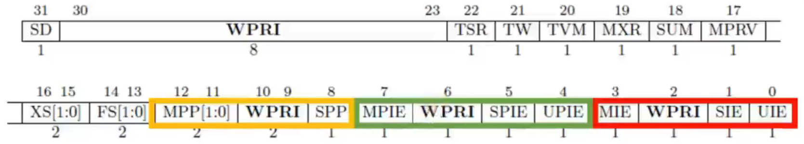

### RISC-V Trap 处理中涉及的寄存器

> 引入：RISC-V 标准有三种权限级别，分别为 Machine、Supervisor、User 级别，这里是指 Machine 级别下的。Trap 是 RISC-V 中的概念，是异常和中断的总称。在处理 Machine 状态下的中断时，需要涉及到一些寄存器，即 CSR（Control Status Register），这里就是在讨论 Machine 模式下的 Trap 涉及到的一些寄存器。

 

#### metvc （Machine Trap-Vector Base-Address）

寄存器格式：

其中，Base 表示 trap 入口函数的基地址，就是当发生中断时的入口地址。由于寄存器的最后两位用于设置MODE，所以最后两位默认是0，也就意味着这个寄存器的值需要是一个按4字节对齐的数，这样才能保证后两位一开始是00。

这里的 MODE 用于进一步控制入口函数的地址配置方式，可以选择 Direct 和 Vectored。前者就是让发生中断的时候，PC 跳转到 BASE 指定的地址处，然后可以根据中断处理函数中的switch选择特定的函数来执行。而后者是让中断的入口地址以数组方式排列，让异常号作为下标，直接定位到某个异常的处理函数中，速度更快。

 

#### mepc （Machine Exception Program Counter）

寄存器格式：

在进入中断前，需要将PC值保存起来，就是保存到这个 mepc 寄存器。当中断程序执行完之后返回时，就可以将这个寄存器的值赋值到 PC，进入正常控制流接着执行指令。

 

#### mcause (Machine Cause)

存储器格式：

当 trap 发生时，这个寄存器会告诉我们 trap 发生的原因。Interrupt 如果为 1，表示了当前 trap 为 interrupt，如果为 0，表示当前 trap 为 exception。剩下的 Exception Code 标识具体 interrupt 或者 exception 的种类。

 

#### mtval (Machine Trap Value)

存储器格式：

当 trap 发生时，mcause 会告诉我们 trap 发生的原因。这个寄存器是对异常信息的补充，和 mcause 搭配使用的。

 

#### mstatus（Machine Status）

存储器格式：

这个寄存器是用来保存机器当前的状态的。比如 M/S/U模式下全局中断是否打开、trap 之前的系统权限级别。

xIE（x=M/S/U）(红颜色的部分)：打开（1）或者关闭（0）M/S/U 模式下的全局中断。当 trap 发生时，hart 会将 xIE 设置为 0。

xPIE（x=M/S/U）(绿颜色的部分)：当 trap 发生时用于保存 trap 发生之前的 xIE 值，即保存红颜色部分的值。

xPP（x=M/S）(黄颜色的部分)：当 trap 发生时用于保存 trap 发生之前的权限级别值。

 

**Question**：为什么xPP（即黄颜色的部分）x的取值只有（x=M/S），且 MPP 为 2 位，SPP 为 1 位？

xPP 是用来保存权限级别值的，MPP 有 U —> M、S —> M、M —> M 三种权限切换状态，需要用两位保存；SPP 有 U —> S，需要一位保存。

 

---

### RISC-V Trap 处理流程

Trap 执行的过程大致可以分为四个步骤：

