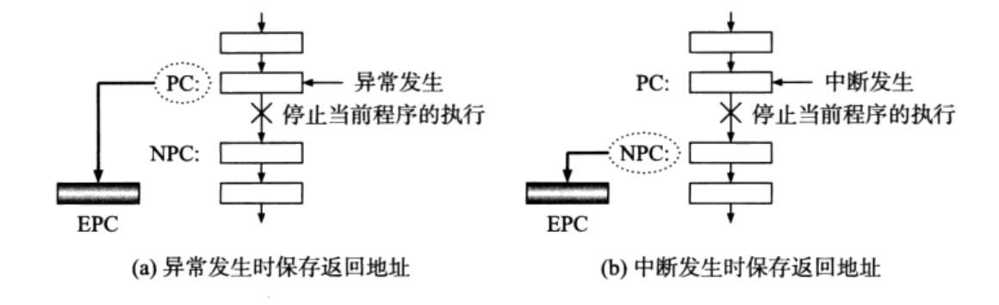
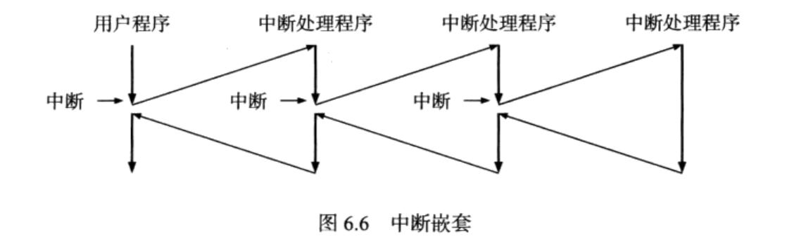
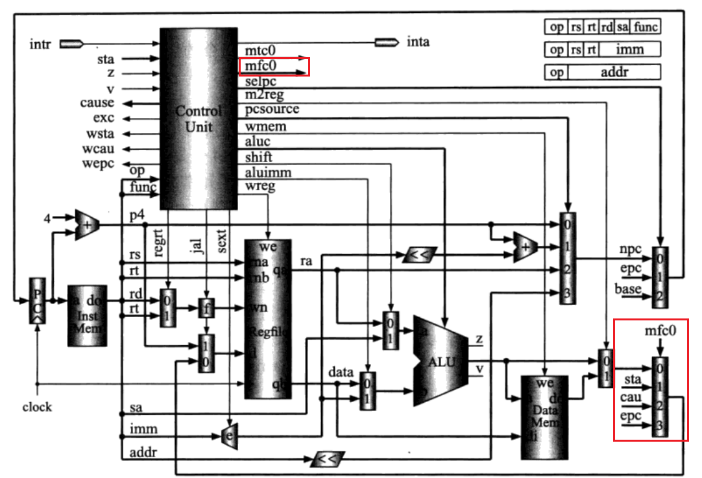

## 异常和中断

异常来自于CPU的内部，中断来自CPU的外部，可以称之为“内部同步异常”和“外部异步中断”。

异常或中断处理程序，通常驻留在操作系统内核。

异常或中断处理程序执行的最坏结果是输出一些信息后停机，最好的结果是做一些适当的处理然后恢复执行被停止的程序。

正常的系统调用有时也被归于异常。原因在于，系统调用是一条指令，用户通过它来享受操作系统提供的服务。因为是指令，所以它不是不可预知的事件。但是对系统调用指令的处理和对通常异常和中断的处理很类似，所以也算作异常。

## 如何从当前执行的程序跳转到异常或中断处理程序？

两种方法。**查询中断**和**向量中断**

### 查询中断

就是当异常或中断发生时，CPU总是跳转到一个固定的地址，从那里查询到底出了什么状况，再转去执行异常或中断处理程序。其中这个固定的地址有两种方法：第一种，直接写死，就一直从那个地方查询（查询这个是个什么中断，以及接下来要做的事）；第二种，设置一个入口地址寄存器，每次异常产生时，就把这个寄存器的值放到PC中，这样PC就从这个寄存器存放的地址的位置开始查询了。

现在，CPU知道异常发生时，该去哪里找查询信息了。下一个问题，怎么通过查询知道是什么异常或中断及做出相应的处理？

解决方法如下：设置一个专门的寄存器。当异常或中断发生时，硬件能自动把源的信息记录到这个寄存器。CPU在入口处的时候，先读取这个寄存器，就知道当前是谁要引起“暴乱”。接着，就是转移到专门的程序中去对付它。这个寄存器称为 Cause 寄存器。

### 向量中断

查询中断有些像汇编语言中的查询向量表，从一个固定地址的字典中查找异常或中断处理程序的入口。而向量中断没有这样的表。向量中断是这样做的：异常或中断发生时，会对应一个“向量”。CPU硬件会把这个向量放在中间，左边右边添加适当的数据，三部分合起来就形成一个地址。把这个地址放到PC中，这样就可以直接跳转到对应的异常或中断处理程序入口去执行了。

或者中间会多一步。三部分合起来就形成一个地址后，不是直接把这个地址放到PC中，然后定位处理程序入口，而是用这个地址访问存储器，这个访问的存储器里存放着处理程序的入口。再将这个存储器里存放的数据放到PC里，这样就定位到处理程序入口了。

可以发现向量中断中没有“查表”的过程，通过直接将异常或中断的“标号”（向量）加一点拼接，作为地址进行定位处理程序入口的操作。

## 中断返回

这里讨论CPU在处理完异常或中断后，是怎么返回到当初被打断的程序继续执行的。

首先，返回之前被打断的程序处，需要找到被打断程序处的地址。这个地址只要在转向异常或中断时，把这个地址值保存到一个安全的位置就可以了。保存在哪呢？各不相同。有保存到通用寄存器的，有设置一个专门的寄存器保存的，比如MIPS CPU中的EPC寄存器，有的是用存储器堆栈保存的，比如 Intel x86 CPU。

注意，这里保存的“返回地址”不能笼统的说是打断程序处的地址，而会依据是内部异常或外部中断而不同。具体来说，内部异常，返回地址是引起异常的指令的地址（就可以理解为跳转前的当前地址吧）；而外部中断，返回地址是下一条指令的地址，NPC。原因解释：内部异常的指令可能需要重新执行，所以返回地址为当前地址，而外部中断发生时，是先执行完当前指令后，再进入中断的，所以是下地址。

### 中断返回的代码表示

从异常或中断处理程序返回的指令为：eret。这个指令做的任务是：把EPC，也就是下地址，写回到PC。如何控制返回指向跳转前的当前地址还是下一条地址？是这样做的：如果引起的指令不需要重新执行了，就在返回前把EPC+4，如果需要重新执行，那么就不加4。

## 中断屏蔽和中断嵌套

在执行中断处理程序时，又出现中断请求了，那么是否还会进入中断的中断，即中断嵌套？答案是可以灵活调整。可以在进入中断处理程序后，自动屏蔽中断，即“关中断”，这时候再来中断也不会理睬的；如果进入中断程序后，“开中断”的选项还是打开的，那就是允许中断，这时候就会进入中断嵌套。当然，进入中断嵌套前，依然要保护好现场，记录好返回地址，无论是存储在专用寄存器，还是通用寄存器，或是寄存器堆栈中。

## 中断优先级

如果有多个外部中断同时向CPU发出请求，CPU相应哪一个呢？答案是相应优先级最高的那一个。如何区分它们的优先级呢？使用一个优先级编码器，来选择优先级较高的中断。

## 带有异常和中断处理功能的CPU总体结构

mfc0指令：将 Status、Cause、EPC 寄存器选择一个写入通用寄存器堆。选择由四选一多路器完成，选择信号为 mfc0。

mtc0指令：把通用寄存器堆中的一个寄存器内容写入 Status、Cause或者 EPC 寄存器。写使能信号为 wsta、wcau、wepc。

异常或中断产生——控制部件知道是否出现异常或中断——查看Status寄存器的信息 sta 判断异常是否被屏蔽——如果没有被屏蔽，控制部件产生 ExcCode——写入 Cause 寄存器