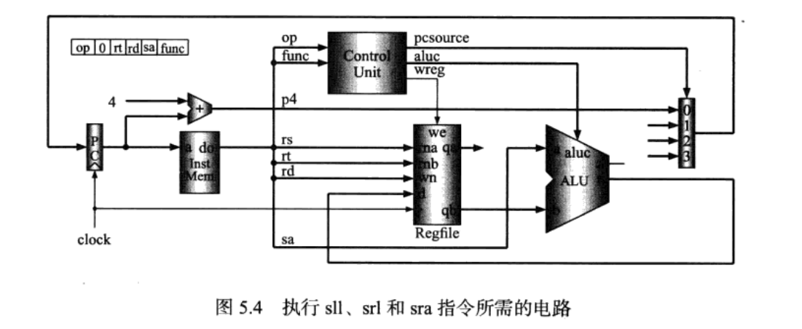
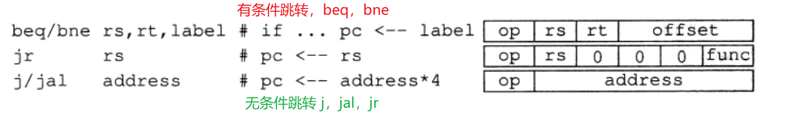

# 基础知识

## 执行一条指令

计算机程序由一条条指令及数据构成。运行的过程大致是这样的：程序一开始存储于硬盘中，当计算机要执行一条程序时，先将程序从硬盘调入内存，然后CPU从内存取出指令，开始执行。操作系统本身也是程序。

往细了来说，CPU在处理指令时，一般需要经过以下几个步骤： 

(1) 取指令(IF)：根据程序计数器PC中的指令地址，从存储器中取出一条指令，同时，PC根据指令字长度自动递增产生下一条指令所需要的指令地址，但遇到“地址转移”指令时，则控制器把“转移地址”送入PC，当然得到的“地址”需要做些变换才送入PC。 

(2) 指令译码(ID)：对取指令操作中得到的指令进行分析并译码，确定这条指令需要完成的操作，从而产生相应的操作控制信号，用于驱动执行状态中的各种操作。 

(3) 指令执行(EXE)：根据指令译码得到的操作控制信号，具体地执行指令动作，然后转移到结果写回状态。 

(4) 存储器访问(MEM)：所有需要访问存储器的操作都将在这个步骤中执行，该步骤给出存储器的数据地址，把数据写入到存储器中数据地址所指定的存储单元或者从存储器中得到数据地址单元中的数据。 

(5) 结果写回(WB)：指令执行的结果或者访问存储器中得到的数据写回相应的目的寄存器中。 

## 取指令

取指令比较简单，因为对于所有的指令来说，取指令的操作都是一样的：CPU取指令时把程序计数器（PC）中的值作为访问存储器的地址，来取得一条32位的指令。如果指令没有引起转移，PC值+4；如果转移，要把转移的目标地址写入PC。

### 取指令的电路设计

如图所示。这个模块的输入是a，也就是地址，输出是do，也就是指令。其中的加法器用于 PC + 4，它的输出接到多路器的一个输入端。其中的多路选择器用于选择是不是要执行 PC + 4（如果取来的指令没有引起跳转和转移，那么多路选择器选择 PC + 4，在时钟上升沿打入PC；如果没有，那再另说）

## 执行指令

预先知识：

20条 MIPS 整数指令

### 寄存器计算类型指令执行

寄存器计算类型的指令有：add、sub、and、or、xor、sll、srl、sra

执行 add、sub、and、or、xor 这几个操作的电路如下图

分析：可以观察到它们的操作码 op 都是0，用 func 来区分不同的计算类型。这几个 MIPS 指令属于三操作数指令。

工作过程是这样的：

首先，根据 rs 和 rt 这两个5位寄存器从寄存器堆（Regfile）中找到两个 32 位数据，这两个32位数据分别被送到 ALU 的 a 和 b 的输入端。

接下来，就到了 ALU 的计算环节了。输入是 指令的操作码 op 和 功能码 func ，输出是 ALU 操作控制码 aluc、计算结果是否写入寄存器堆的控制信号 wreg 和 下一条指令的地址选择信号 pcsource。

最后，ALU 的计算结果要写入寄存器堆。写到32个寄存器中的哪一个地方，由5位目的寄存器号 rd 指定。

执行移位指令 sll（Shift Left Logical）、srl（Shift Right Logical）、sra（Shift Right Arithmetic） 这几个操作的电路如下图

分析：它们的操作码 op 仍然都是 0，用 func 来区分不同的计算类型。这几个 MIPS 指令仍属于三操作数指令。

这里相较于之前的变化是：ALU 的两个输入值 a，b 不是都来源于寄存器堆的两个输出值 qa，qb，而是 ALU 输入中的 b 来源于寄存器堆的输出值 qb，ALU 输入中的 a 来源于 指令中的5位 sa。即，ALU 的输入现在是 32 位数据和要移动的位数。这里寄存器号 rs 没有使用，按规定这5位被设置为0。

之前的 ALU 的输入是两个 32 位数据，现在 ALU 的输入是 一个 32 位数据和 5 位的移位位数，所以 ALU 中对数据的处理也会不一样。具体来说，把 sa 的移位位数放到最右边，在设计 ALU 的时候只用低 5 位进行移位操作。

于是，ALU 的输入端 a 的数据来源有两个（可能是来自寄存器堆的 qa，也可能是来自指令中的 sa），要根据取来的指令，判断出选择哪个路。这时候就可以使用多路选择器，具体选哪个的信号由控制部件产生。

### 立即数计算类型指令执行

上面的内容是关于寄存器计算类型指令的执行，概括来说，分为执行 add、sub、and、or、xor 这几个指令和执行移位指令两类。前者 ALU 的两个输入由寄存器堆的两个数据产生，后者 ALU 的两个输入由寄存器堆的一个数据和指令中的移位数据产生。而立即数计算类型执行指令不同寄存器计算类型指令的是，ALU 的操作数 b 是来自于指令中的立即数（即 ALU 的输入 b 就放在指令中，没有取址操作了）。

立即数计算类型的指令涉及有：addi、andi、ori、xori 和 lui，它们仅由 op 区分，它们的特点是 ALU 操作数 b 来自于指令中的立即数。除了 lui（加载上半部分立即数，将一个16位的立即数放到寄存器的高16位，低16位被清零） 之外，其余仍然都是三操作数，而 lui 为两操作数。

注意，一般寄存器取得的值是32位的，但是立即数为 16 位，需要进行扩展。怎么扩展？要求算数运算指令 addi 进行符号扩展，逻辑运算指令 andi、ori 和 xori 进行零扩展。这通过控制信号sext（Sign Extend）为 1 时符号扩展，否则零扩展。

### 访问存储器指令执行

访问存储器的指令：lw(Load Word) 从数据存储器中读数据、sw(Store Word) 往存储器中写数据。两条指令中，对于计算存储器的地址的方法是把两个数相加：一个数是使用 rs 从寄存器堆中读出，另一个数是把指令中的16位立即数进行符号扩展得到的。把这两个数相加，相加的结果就作为存储器的地址。lw指令把从存储器读出的数据写入由rt指定的寄存器中；sw指令把rt寄存器的数据写入寄存器。

这里存储器的类型暂且有两种：指令存储器和数据存储器。

现在，将存储器也加到流程图里。

### 条件转移类型指令执行

上面的内容中，无论是计算类型指令(寄存器计算类型、立即数计算类型)，还是访问访问存储器指令执行，pcsource 信号都是设置为 00，即多路选择器总是选择让 PC + 4 作为下一条指令的地址。而条件转移的指令就有所不同了。条件转移指令有 beq(Branch on Equal) 和 bne(Branch on Not Equal)。

其中，判断是否转移的流程是：首先使用 rs 和 rt 从寄存器堆读出两个数据，再放到 ALU 中比较它们是否相等，然后决定是否转移。beq 是相等转移，dne 是不等时转移。如果算出来要转移，那让pcsource = 01，选择要转移的目标地址，如果不用转移了，那就让pcsource = 00，选择 PC + 4。

那么，如果判断出要转移后，转移地址的计算：由一个专门的加法器完成。加法器的两个输入端为：PC + 4 和立即数再左移两位的数据。这里立即数的扩展为符号扩展，这时的立即数为偏移量，使用它做PC相对转移。

加上条件转移指令的流程图如下。

### 跳转和子程序调用及返回类型指令执行

无条件跳转相关指令为：j(Jump)、jal(Jump and Link)、jr(Jump Register)。

j 指令：实现无条件跳转，指令中的26位地址左移两位变成 28 位，再与PC+4的高4位拼接在一起，构成32位转移地址，写人PC。

jal 指令：调用子程序的指令。它除了完成和 j 指令一样的任务之外，还将 PC + 4 写入寄存器 r31，即保存返回地址。

jr 指令：把从 rs 指定的寄存器中读出的内容写入 PC，这样就能跳转到指定的地址了。也可以用于从子程序返回(rs = 31)。

j 指令的电路如下，因为只要左移指令中的地址，再与 PC + 4 的高四位拼接就行了，所以很简单。

jal 指令的电路如下，比 j 指令多了将返回地址写入到 r31 寄存器

jr 指令的电路如下，实现的是：把rs指定的寄存器中读出的内容写入 PC

## 寄存器堆设计

## 数据路径设计

CPU 的电路包括**数据路径(Datapath)** 和 **控制部件(Control Unit)** 两个部分。

本部分为单周期 CPU 的总体数据路径

### 多路选择器的使用

对于一种输入有多种来源(比如ALU的b输入端，有时是从寄存器堆中取来的值，有时是立即数)，就可以使用多路选择器，再通过控制信号来选择一个作为输入。

#### 1. 控制信号 pcsource

程序不进行转移时，PC + 4，但有时程序会进行跳转，会引起跳转的指令有以下五条。

| pcsource | 通路       |    备注 |
| -------- | ---------- | ------: |
| 0        | PC + 4     |      无 |
| 1        | BranchAddr | beq,bne |
| 2        | RegAddr    |      jr |
| 3        | JumpAddr   |   j,jal |

对应于电路图：

#### 2. 控制信号 shift

这里的输入源为：ALU 的 a 输入端的选择

涉及到的指令为两条寄存器操作型指令：一条是加法指令，一条是移位指令。

这里 ALU 的 a 输入端有两个数据源：一个来自寄存器 qa 端，一个来自指令中的 sa。我们使用二选一多路器从中选择一个，多路选择器的控制信号命名为 shift。当 shift = 1，选择 sa。

#### 3.  控制信号 aluimn 和 regret

这里的输入源为：ALU 的 b 输入端和寄存器堆 wn 输入端

涉及到的指令为两条指令：一条是寄存器型指令，一条是立即数型指令。

在 add 指令中，会从寄存器堆的rt寄存器读出32位数据将它送至 ALU的b输入端。ALU的加法结果保存到寄存器堆的rd寄存器中。

在 addi 指令中，会把指令中的立即数经符号扩展后送至 ALU 的b输入端。ALU的加法结果保存到rt寄存器中。

这里ALU的b输入端有两个数据源:一个来自寄存器堆的qb端，一个来自指令中的 imm。对应二选一多路选择器的选择信号为 aluimn。当 alumin = 1时，选择立即数，否则，选择寄存器操作数。

这里寄存器堆的 wn输人端(目的寄存器号)也有两个数据源:一个来自指令中的 rd，一个来自指令中的rt。对应二选一多路选择器为 regret。当 regret = 1时，选择 rt，否则，选择 rd。

#### 4. 控制信号 m2reg 和 jal

这里涉及到用多路选择器的地方：ALU 的输出 or 数据存储器的输出、要写入寄存器堆哪32位数据、写到寄存器堆中的哪个寄存器。

### 单周期 CPU 的总体电路

单周期 CPU + 指令存储器 + 数据存储器 的总体电路图

