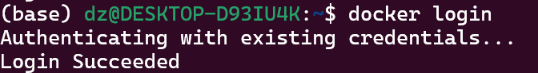
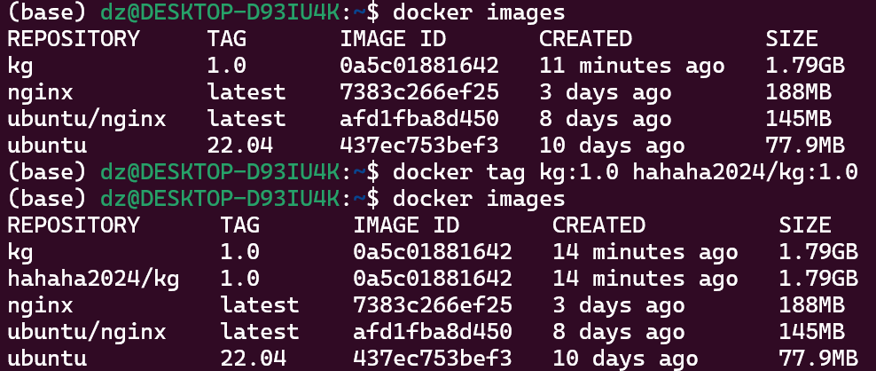

## 常见问题

> denied: requested access to the resource is denied

解决：镜像的名称和账户的名称没有对应上

1. 登录 Hub 账户

```bash
 docker login
```



2. 更改好镜像的名字

``` bash
docker tag old-repo/my-image:1.0 new-repo/my-image:1.0
```



参考：[解决docker：denied: requested access to the resource is denied_docker login': denied:-CSDN博客](https://blog.csdn.net/fengpengfei_yes/article/details/113838579)

---

> Docker 拉取时太慢

[配置 docker 加速服务-阿里云开发者社区 (aliyun.com)](https://developer.aliyun.com/article/929177)
